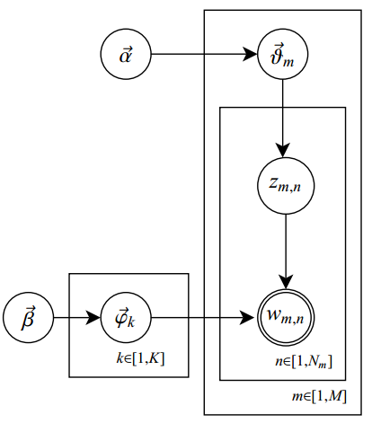

## 通俗理解LDA

### 简介

在机器学习领域，LDA是两个常用模型的简称：Linear Discriminant Analysis和Latent Dirichlet Allocation。本文的LDA仅指代Latent Dirichlet Allocation，潜在狄利克雷分布。

LDA可以将文档集中每篇文档的主题以概率分布的形式给出，从而通过分析一些文档抽取出它们的主题（分布）出来后，便可以根据主题（分布）进行主题聚类或文本分类。

LDA是一种典型的词袋模型，即一篇文档是由一组词构成，词与词之间没有先后顺序关系。

此外，一篇文档可以包含多个主题，文档中每一个词都由其中的一个主题生成。

### 简单应用情形

假设实现给定了几个主题：Arts、Budgets、Children、Education，然后通过学习训练，获取每个主题Topic对应的词语。

然后，以一定的概率选取上述某个主题，再以一定的概率选取那个主题下的某个单词，不断的重复这两步，最终生成的一篇文章。

而，当我们看到一篇文章后，往往喜欢推测这篇文章时如何生成的。我们可能会认为作者先确定这篇文章的几个主题，然后围绕这几个主题遣词造句，表达成文。

LDA就是要干这个事：根据给定的一篇文档，反推其主题分布。通俗来讲，可以假定认为，人类是根据上述文档生成过程写成了各种各样的文章，现在有些人想让计算机利用LDA干一件事：分析网络上每篇文章都写了些啥主题，且每篇文章中各个主题出现的概率大小（概率分布）。

### 整体把握

LDA模型的主要难度在于，LDA内部涉及到太多的数学知识。

在LDA模型中，一篇文档生成的方式如下：

- 从狄利克雷分布$\alpha$中取样生成文档$i$的主题分布$\theta_i$
- 从主题的多项式分布$\theta_i$中取样生成文档$i$第$j$个词的主题$z_{i,j}$
- 从狄利克雷分布$\beta$中取样生成主题$z_{i,j}$对应的词语分布$\phi_{z_{i,j}}$
- 从词语的多项式分布$\phi_{z_{i,j}}$中采样最终生成词语$w_{i,j}$

其中，类似Beta分布是二项式分布的共轭先验概率分布，而狄利克雷（Dirichlet分布）是多项式分布的共轭先验概率分布。

此外，LDA的图模型结构如下图所示（类似贝叶斯网络结构）：

### 参考链接

[通俗理解LDA主题模型](https://blog.csdn.net/v_july_v/article/details/41209515)

[一文详解LDA主题模型](https://zhuanlan.zhihu.com/p/31470216)