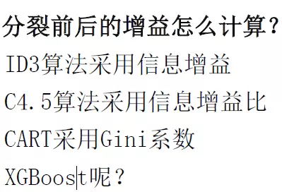

[第06章：深入浅出ML之Boosting家族]: http://www.52caml.com/head_first_ml/ml-chapter6-boosting-family/	"Adaboost写的很不错"

最后的预测结果是投票，少数服从多数。

[机器学习-一文理解GBDT的原理-20171001]: https://zhuanlan.zhihu.com/p/29765582	"GDBT写的很不错"

此篇文章有一个错误：GDBT的求导过程写错了，该过程其实应该为xgboost的求导过程。虽然写错了，但这个求导过程写的挺好，值得作为学习xgboost时的参考。

（1）使用的是回归树。（2）GDBT拟合的是残差。（3）最后的预测结果是每棵树的预测结果相加。

[XGBoost算法原理小结]: https://www.cnblogs.com/pinard/p/10979808.html

（1）注意常考GDBT与XGboost的不同。

作为GBDT的高效实现，XGBoost是一个上限特别高的算法，因此在算法竞赛中比较受欢迎。简单来说，对比原算法GBDT，XGBoost主要从下面三个方面做了优化：

一是算法本身的优化：在算法的弱学习器模型选择上，对比GBDT只支持决策树，还可以直接很多其他的弱学习器。在算法的损失函数上，除了本身的损失，还加上了正则化部分。在算法的优化方式上，GBDT的损失函数只对误差部分做负梯度（一阶泰勒）展开，而XGBoost损失函数对误差部分做二阶泰勒展开，更加准确。算法本身的优化是我们后面讨论的重点。

二是算法运行效率的优化：对每个弱学习器，比如决策树建立的过程做并行选择，找到合适的子树分裂特征和特征值。在并行选择之前，先对所有的特征的值进行排序分组，方便前面说的并行选择。对分组的特征，选择合适的分组大小，使用CPU缓存进行读取加速。将各个分组保存到多个硬盘以提高IO速度。

三是算法健壮性的优化：对于缺失值的特征，通过枚举所有缺失值在当前节点是进入左子树还是右子树来决定缺失值的处理方式。算法本身加入了L1和L2正则化项，可以防止过拟合，泛化能力更强。

在上面三方面的优化中，第一部分算法本身的优化是重点也是难点。现在我们就来看看算法本身的优化内容。

（2）XGboost分裂前后的增益怎么算：

XGboost用打分函数来计算信息增益。

[机器学习中Bagging和Boosting的区别]: https://blog.csdn.net/u013709270/article/details/72553282

