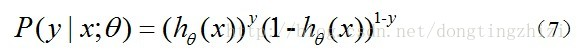
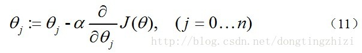

# Logistic回归

## sigmoid函数

sigmoid函数：
$$
\sigma(z)=\frac{1}{1 + e^{-z}}
$$

sigmoid函数的一阶导数：
$$
\begin{aligned}
f'(z) &= (\frac{1}{1+e^{-z}})' 
\\
&= \frac{e^{-z}}{(1+e^{-z})^{2}} 
\\
&= \frac{1+e^{-z}-1}{(1+e^{-z})^{2}}  
\\
&= \frac{1}{(1+e^{-z})}(1-\frac{1}{(1+e^{-z})}) 
\\
&= f(z)(1-f(z))
\\
\end{aligned}
$$

## 什么是Logistic回归

跟许多机器学习算法一样，逻辑回归也是从统计学中借鉴而来。

尽管名字里有回归两个字，但它不是一个需要预测连续结果的回归算法。

与之相反，逻辑回归是二分类任务的首选算法。它的输出是一个0到1之间的离散二值结果。简单来讲，它的结果不是1就是0。

- 为了实现Logistic回归分类器，我们可以在每个特征上都乘以一个回归系数，
- 然后把所有结果相加，将这个综合带入Sigmoid函数中，进而得到一个范围在0~1之间的数值。
- 任何大于0.5的数据被分入1类，下雨0.5即被分入0类。所以Logistic回归也可以被看成是一种概率估计。

## 逻辑回归推导

[参考链接](https://blog.csdn.net/ligang_csdn/article/details/53838743)

预测函数：

取似然函数：

对数似然函数：

最大似然估计就是要求得使$l(\theta)$取最大值的$\theta$，其实这里可以用梯度上升法求解。但是在Andrew Ng的课程中将$J(\theta)$取下式：

梯度下降求$J(\theta)$得最小值：

因此，（11）式可以更新为：

由于式中$\alpha$本来为一常量，所有$1/m$一般可以省略，即：

## 逻辑回归优缺点

- 简单高效、不需要太过计算量、通俗易懂
- 不需要缩放输入特征，不需要任何调整，且很容易调整
- 不能用逻辑回归解决非线性问题，因为它的决策边界是线性的
- 逻辑回归高度依赖正确的样本数据

## 逻辑回归实现多分类

[参考链接](https://blog.csdn.net/SZU_Hadooper/article/details/78619001)

1. 直接根据每个类别，都建立一个二分类器，带有这个类别的样本标记为1，带有其他类别的样本标记为0。假如我们有k个样本，最后我们就得到k个针对不同标记的普通的逻辑回归分类器
2. 修改logistic回归的损失函数，让其适应多分类问题。这个损失函数不再笼统地只考虑二分类非1即0的损失，而是具体考虑每个样本的损失。这种方法叫做softmax回归，即logistic回归的多分类版本

对于选择softmax分类器还是k个logistic分类器，取决于所有类别之间是否互斥。

- 如果所有类别之间明显互斥，选择softmax分类器
- 如果所有类别之间不互斥有交叉的情况下，最好用k个logistic分类器

## 面试常考

- 逻辑回归为什么比线性回归好？

  LR广义上说也是一种线性回归，但是可以通过加入核函数，来解决非线性问题。

  从损失函数角度来看，LR的损失函数是基于释然函数的，而传统线性回归模型的损失函数的最小二乘损失。

- 为什么逻辑回归问题要用sigmoid函数？

  优点：sigmoid函数能将数据压缩到0-1之间，适用于概率解释；sigmoid函数求导方便。

  缺点：sigmoid函数存在饱和区，在反向传播时容易造成梯度消失。

  既然有缺点，为什么还要用？深层次原因在于，逻辑回归模型是对有“两点分布”的数据，利用释然函数来进行二分类的模型，两点分布的函数的指数表达式就是sigmoid函数的形式。

- LR回归为什么使用对数损失函数，而不使用平方损失？

  可以使用平方损失，但是构造出来的损失函数是一个非凸函数，求解容易陷入局部最优，效果比价差。

  但如果用sigmoid函数+对数形式的极大似然函数，这个函数在数学上是连续可导的凸函数，便于求解，最终效果更好。

- 逻辑回归的优缺点？（参考上面）

  优点：结构简答，便于求解，适用于工程中有大量特征的数据，并且可以用梯度下降求解

  缺点：对数据不均衡的处理能力比较弱，并且精度不够高

- LR与SVM的本质区别？

  损失函数不同。

  由于损失函数不同，模型的输出也不同。LR输出是概率，SVM输出的是最大分类距离。

  处理数据方式不同。LR是提取特征->特征离散化->特征组合，然后输出；SVM是通过选取支撑向量，也就是部分数据，然后利用核函数就行高维度特征映射，进行分类。

[深度学习基础篇](https://zhuanlan.zhihu.com/p/71575651)

