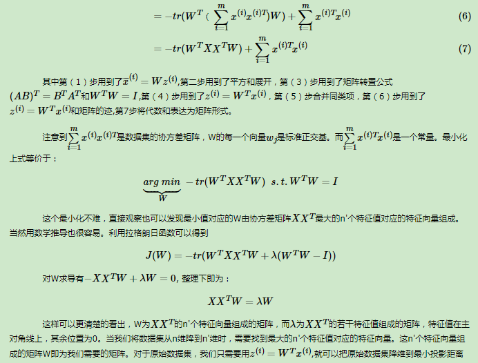

[TOC]

算法举例：常见的有监督机器学习算法包括支持向量机(Support Vector Machine, SVM)，朴素贝叶斯(Naive Bayes)，逻辑回归(Logistic Regression)，K近邻(K-Nearest Neighborhood, KNN)，决策树(Decision Tree)，随机森林(Random Forest)，AdaBoost以及线性判别分析(Linear Discriminant Analysis, LDA)等。深度学习(Deep Learning)也是大多数以监督学习的方式呈现。

常见应用场景：常见的应用场景包括关联规则的学习以及聚类等。

​	算法举例：常见算法包括Apriori算法以及k-Means算法。

图论推理算法（Graph Inference）

  1）adaboost是一种有很高精度的分类器。 2）可以使用各种方法构建子分类器，Adaboost算法

# Logistic回归

## 1.什么是Logistic回归

是一个二值型输出分类器。

sigmoid函数：$\sigma(z)=\frac{1}{e^{-z}}$

为了实现Logistic回归分类器，我们可以在每个特征上都乘以一个回归系数，然后把所有结果相加，将这个综合带入Sigmoid函数中，进而得到一个范围在0~1之间的数值。任何大于0.5的数据被分入1类，下雨0.5即被分入0类。所以Logistic回归也可以被看成是一种概率估计。

## 2.基于最优化方法的最佳回归系数的确定

# 支持向量机(Support Vector Machine, SVM)（结合第二章内容一起看）

## 1.什么是支持向量机SVM？

支持向量机是一种二分类模型，它的目的是寻找一个超平面来对样本进行分割，分割的原则是边界最大化，最终转化为一个凸二次规划问题来求解。由简至繁的模型包括：

​	当训练样本线性可分时，通过硬边界（hard margin）最大化，学习一个线性可分支持向量机；

​	当训练样本近似线性可分时，通过软边界（soft margin）最大化，学习一个线性支持向量机；

​	当训练样本线性不可分时，通过核技巧和软边界最大化，学习一个非线性支持向量机；

（SVM有很多种实现方式，本文只介绍最流行的一种实现，即**序列最小优化**。**其基本模型定义为特征空间上的间隔最大的线性分类器**，即支持向量机的学习策略便是间隔最大化，最终可转化为一个凸二次规划问题的求解。在求解的过程中，会发现只根据支持向量的数据就可以确定分类器。）

## 2.需要掌握的SVM知识点

SVM整体可以分成三个部分：

1. **SVM理论本身**：包括最大间隔超平面（Maximum Margin Classifier），拉格朗日对偶（Lagrange Duality），支持向量（Support Vector），核函数（Kernel）的引入，松弛变量的软间隔优化（Outliers），最小序列优化（Sequential Minimal Optimization）等。

2. **核方法（Kernel）**：其实核方法的发展是可以独立于SVM来看待的，核方法在很多其它算法中也会应用到。

3. **优化理论**：这里主要介绍的是最小序列优化（Sequential Minimal Optimization），优化理论的发展也是独立于SVM的。

接下来，就这三部分分别进行介绍：

### 2.1SVM理论

#### 2.1.1基于最大间隔分隔数据

1. 分隔超平面：分类的决策边界。（确定分隔超平面的依据：如果数据点离决策边界越远，那么其最后的预测结果也就越可信。所以我们希望找到离分隔超平

   面最近的点，确保它们离分隔面的距离尽可能远，以让分类器尽可能健壮。）

2. 间隔：点到分隔面的间隔。

3. 支持向量：离分隔超平面最近的那些点。

#### 2.1.2寻找最大间隔

1.分隔超平面（即分类器）的形式可以写成：

$$
f(x)=w^T*x+b
$$
2.点到分隔面的距离为：
$$
\frac{|w^A+b|}{||w||}
$$

3.**分类器求解的优化问题**：

目标：找出分类器（即分隔超平面）定义中的w和b。

（1）目标函数：
$$
arg \quad max_{w,b} \quad \lbrace (min_n (label \cdot (w^Tx+b))) \cdot \frac{1}{||w||} \rbrace
$$
（2）直接求解上述问题相当困难，所以我们将它转换成为另一种更容易求解的形式：
$$
arg \quad max_{a,b} \quad \frac{1}{||w||}\\
 s.t. \quad label \cdot (w^T+b) \geq 1
$$
（3）进一步，转化为更容易求解的形式：
$$
arg \quad min_{a,b} \quad \frac{1}{||w||^2}\\
 s.t. 1 -label \cdot (w^Tx+b) \leq 0
$$
 （3）因为该问题是一个带约束条件的优化问题，对于这类优化问题，有一个非常著名的求解方法，即拉格朗日乘子法。通过引入拉格朗日乘子，我们就可以基于约束条件来表述原来的问题。所以，目标函数可转化为如下形式：
$$
\text{拉格朗日方程式：}L(w,b,\alpha)=\frac{1}{2}||w||^2+\sum_{i=1}^m \alpha_i(1- lable _i\cdot(w^Tx+b))\\
\text{目标函数为：}min_{w,b}max_\alpha L(w,b,\alpha)
$$
（4）当问题满足KKT条件时，原问题的解与其对偶问题的解相同。现在我们要求解的原问题符合KKT条件，而原问题难以求解，我们可以把它转化成对偶问题进行求解：
$$
\text{目标函数为：}max_\alpha min_{w,b} L(w,b,\alpha)
$$
> **KKT条件简要介绍**
>
> 一般地，一个最优化数学模型能够表示成下列标准形式：
> $$
> minf(x)\\
> s.t. \quad h_j(x)=0,j=1,\cdots,p,\\
> g_k(x)\leq0,k=1,\cdots,q,\\
> x\in X \subset R^n
> $$
> 其中，f(x)是需要最小化的函数，h(x)是等式约束，g(x)是不等式约束，p和q分别为等式约束和不等式约束的数量。同时，我们得明白以下两个定理：
>
> - 凸优化的概念： 为一凸集，  为一凸函数。凸优化就是要找出一点  ，使得每一  满足  。
> - KKT条件的意义：它是一个非线性规划（Nonlinear Programming）问题能有最优化解法的必要和充分条件。
>
> 那到底什么是所谓Karush-Kuhn-Tucker条件呢？KKT条件就是指上面最优化数学模型的标准形式中的最小点 x* 必须满足下面的条件：
>
> （1）相应的拉格朗日函数对x的一阶导数为0。
>
> （2）h(x)=0。
>
> （3）言下之意是要么α为0，要么函数g(x)为0。
> $$
> \alpha\cdot g(x)=0,\alpha \geq 0
> $$
> 本目标函数相对应的KKT条件为：
>
> （1）拉格朗日函数对w,b的一阶导数为0。
>
> （2）$\alpha_i(1- lable _i\cdot(w^Tx+b))=0$，要么$\alpha_i=0$（在$1- lable _i\cdot(w^Tx+b) \leq 0$时）,要么$1- lable _i\cdot(w^Tx+b) = 0$。

（5）化简，上述目标函数变成：
$$
max_\alpha [\sum_{i=1}^m \alpha - \frac{1}{2}\sum_{i,j=1}^mlabel^{(i)}\cdot label^{(j)} \cdot \alpha_i \cdot \alpha_j \langle x^{(i)},x^{(j)} \rangle]\\
\alpha \geq0,和\sum_{i-1}^m \alpha_i \cdot label^{(i)}=0
$$
目标函数由（4）至（5）的化简过程为：
$$
\begin{eqnarray}
L(w,b,\alpha) & = & \frac{1}{2}||w||^2+\sum_{i=1}^m \alpha_i-\sum_{i=1}^m\alpha_i\cdot lable_i \cdot(w^Tx+b)\\
& = & \frac{1}{2}w^Tw-\sum_{i=1}^m\alpha_iy_iw^Tx_i-\sum_{i=1}^m\alpha_iy_ib+\sum_{i=1}^m\alpha_i\\
& = &\frac{1}{2}w^T\sum_{i=1}^m\alpha_iy_ix_i-\sum_{i=1}^m\alpha_iy_iw^Tx_i-\sum_{i=1}^m\alpha_iy_ib+\sum_{i=1}^m\alpha_i\\
& = &\frac{1}{2}w^T\sum_{i=1}^m\alpha_iy_ix_i-w^T\sum_{i=1}^m\alpha_iy_ix_i-\sum_{i=1}^m\alpha_iy_ib+\sum_{i=1}^m\alpha_i\\
& = &-\frac{1}{2}w^T\sum_{i=1}^m\alpha_iy_ix_i-b\sum_{i=1}^m\alpha_iy_i+\sum_{i=1}^m\alpha_i\\
& = &-\frac{1}{2}(\sum_{i=1}^m\alpha_iy_ix_i)^T\sum_{i=1}^m\alpha_iy_ix_i-b\sum_{i=1}^m\alpha_iy_i+\sum_{i=1}^m\alpha_i\\ 
& = &-\frac{1}{2}\sum_{i=1}^m\alpha_iy_ix_i^T\sum_{i=1}^m\alpha_iy_ix_i-b\sum_{i=1}^m\alpha_iy_i+\sum_{i=1}^m\alpha_i\\
& = &-\frac{1}{2}\sum_{i=1,j=1}^m\alpha_iy_ix_i^T\alpha_jy_jx_j-b\sum_{i=1}^m\alpha_iy_i+\sum_{i=1}^m\alpha_i(\text{其中，}\sum_{i-1}^m \alpha_i \cdot label^{(i)}=0)\\
& = &\sum_{i=1}^m\alpha_i-\frac{1}{2}\sum_{i=1,j=1}^m\alpha_iy_ix_i^T\alpha_jy_jx_j\\
\end{eqnarray}
$$
（6）至此，一切都很完美，但是这里有个假设：数据必须100%线性可分。目前为止，我们知道几乎所有数据都不那么“干净”。这时我们就可以通过引入所谓松弛变量，来允许有些数 点可以处于分隔面的错误一侧。这样我们的优化目标就能保持仍然不变，但是此时（2）中目标函数的新的约束条件则变为：
$$
arg \quad max_{a,b} \quad \frac{1}{||w||}\\\\
s.t. \quad label \cdot (w^T+b) \geq 1- \varepsilon_i
$$
（7）经过相同的求解思路，最终的目标函数及约束条件为：
$$ {  }
max_\alpha [\sum_{i=1}^m \alpha - \frac{1}{2}\sum_{i,j=1}^mlabel^{(i)}\cdot label^{(j)} \cdot \alpha_i \cdot \alpha_j \langle x^{(i)},x^{(j)} \rangle]\\C
\geq \alpha \geq0,和\sum_{i-1}^m \alpha_i \cdot label^{(i)}=0
$$
这里的C是个很重要的参数，它从本质上说是用来**折中经验风险和置信风险**的，C越大，置信风险越大，经验风险越小；并且所有的拉格朗日乘子都被限制在了以C为边长的大盒子里。

到目前为止，我们已经了解了一些理论知识，我们当然希望能够通过编程，在数据集上讲这些理论付诸实践。接下来将介绍一个简单但很强大的实现算法。

### 2.2优化理论

#### SMO高效优化算法

SMO表示序列最小优化。该算法是将大优化问题分解为多个小优化问题来求解的。这些小优化问题往往很容易求解，并且对它们顺序求解的结果与将它们作为整体来求解的结果是完全一致的。在结果完全相同的同时，SMO算法的求解时间短很多。

SMO算法的目标是求出一系列alpha和b，一旦求出了alpha，就很容易计算出权重向量w并得到分割超平面。

SMO算法的工作原理是：每次循环中选择两个alpha进行优化处理。一旦找到一对合适的alpha，那么就增大其中一个同时减少另一个。这里所谓的“合适”就是指两个alpha必须要符合一定的条件，条件之一就是这两个alpha必须要在间隔边界之外，而其第二个条件则是这两个alpha还没有进行过区间化处理或者不在边界上。

#### 2.2-1回顾SVM优化目标函数

我们首先回顾下我们的优化目标函数：
$$
min_\alpha \frac{1}{2}\sum_{i,j=1}^mlabel^{(i)}\cdot label^{(j)} \cdot \alpha_i \cdot \alpha_j \langle x^{(i)},x^{(j)}-\sum_{i=1}^m \alpha\rangle\\C
\geq \alpha_i \geq0,和\sum_{i-1}^m \alpha_i \cdot label^{(i)}=0
$$
我们的解要满足的KKT条件为：$\alpha_i(lable _i\cdot(w^Tx+b)-1+\xi_i)=0$

根据这个KKT条件，我们有：
$$
\alpha_i^*=0 \implies lable _i\cdot(w^*\cdot \phi (x_i)+b) \geq 1\\
0 < \alpha_i^* < C\implies lable _i\cdot(w^*\cdot \phi (x_i)+b) = 1\\
\alpha_i^*=C \implies lable _i\cdot(w^*\cdot \phi (x_i)+b) \leq 1由于w^*=\sum_{j=1}^m\alpha_j^* lable_j ]
$$
由于$w^*=\sum_{j=1}^m\alpha_j^* lable_j \phi(x_j)$，我们令$g(x)=w^*\cdot\phi(x)+b=\sum_{j=1}^m\alpha_j^*lable_jK(x,x_j)+b^*$，则有：
$$
\alpha_i^*=0 \implies lable _ig(x_i) \geq 1\\
0 < \alpha_i^* < C\implies lable _ig(x_i) = 1\\
\alpha_i^*=C \implies lable _ig(x_i) \leq 1
$$

#### 2.2-2 SMO算法的基本思想

#### 2.2-3 SMO算法目标函数的优化

#### 2.2-4 SMO算法两个变量的选择

SMO算法需要选择合适的两个变量做迭代，其余的变量做常量来进行优化，那么怎么选择这两个变量呢？

#### 2.2-4 计算阈值$b$和差值$E_i$

#### 2.2-5 SMO算法总结

### 2.3核函数

使用一种称为核函数的方式将SVM扩展到更多数据集上。

机器学习算法中，不论是感知机还是支持向量机，在面对非线性问题时，往往都会用到一个名为“核函数”的技巧。那么到底什么是核函数呢？是否真的如听起来这样难以理解呢？

核函数：是映射关系的**内积**，映射函数本身仅仅是一种映射关系，并没有增加维度的特性，不过可以利用核函数的特性，构造可以增加维度的核函数，这通常是我们希望的。

下面是李航的《统计学习方法》中对于核函数的定义：

要注意，核函数和映射没有关系。核函数只是用来**计算**映射到高维空间之后的**内积的一种简便方法**。

一般英文文献对Kernel有两种提法，一是Kernel Function，二是Kernel Trick。从Trick一词中就可以看出，这只是一种运算技巧而已，不涉及什么高深莫测的东西。

具体巧在哪里呢？我们如果想进行原本就线性不可分的数据集进行分割，那么选项一是容忍错误分类，即引入Soft Margin；选项二是我们可以对Input Space做Feature Expansion，把数据集映射到高维中去，形成了Feature Space。我们几乎可以认为（引用Caltech的课堂用语“We are safe but not certain”）原本在低维中线性不可分的数据集在足够高的维度中存在线性可分的超平面。

现实生活中有很多非线性非常强的特征 而核方法能够捕捉它们**。核技巧(kernel trick)的作用，一句话概括的话，就是降低计算的复杂度，甚至把不可能的计算变为可能。**

在机器学习中常用的核函数，一般有这么几类，也就是LibSVM中自带的这几类：

# 朴素贝叶斯(Naive Bayes)

，逻辑回归(Logistic Regression)，K近邻(K-Nearest Neighborhood, KNN)，决策树(Decision Tree)，随机森林(Random Forest)，AdaBoost以及线性判别分析(Linear Discriminant Analysis, LDA)等

# 线性判别分析LDA

## 1. LDA的思想

LDA是一种监督学习的降维技术，也就是说它的数据集的每个样本是有类别输出的。这点和PCA不同。PCA是不考虑样本类别输出的无监督降维技术。LDA的思想可以用一句话概括，就是“投影后类内方差最小，类间方差最大”。什么意思呢？ 我们要将数据在低维度上进行投影，投影后希望每一种类别数据的投影点尽可能的接近，而不同类别的数据的类别中心之间的距离尽可能的大。

可能还是有点抽象，我们先看看最简单的情况。假设我们有两类数据 分别为红色和蓝色，如下图所示，这些数据特征是二维的，我们希望将这些数据投影到一维的一条直线，让每一种类别数据的投影点尽可能的接近，而红色和蓝色数据中心之间的距离尽可能的大。

上图中国提供了两种投影方式，哪一种能更好的满足我们的标准呢？从直观上可以看出，右图要比左图的投影效果好，因为右图的黑色数据和蓝色数据各个较为集中，且类别之间的距离明显。左图则在边界处数据混杂。以上就是LDA的主要思想了，当然在实际应用中，我们的数据是多个类别的，我们的原始数据一般也是超过二维的，投影后的也一般不是直线，而是一个低维的超平面。

在我们将上面直观的内容转化为可以度量的问题之前，我们先了解些必要的数学基础知识，这些在后面讲解具体LDA原理时会用到。

## 2. 瑞利商（Rayleigh quotient）与广义瑞利商（genralized Rayleigh quotient）

## 3. 二类LDA原理

## 4. 多类LDA原理

## 5. LDA算法流程

# 主成分分析PCA

将n维降到n'维的过程：假设n'维的坐标是$w$.根据最大方差理论，求出w的最优解即可。得到坐标轴w后，将原数据的坐标转化成新坐标下的坐标值。

## 1.PCA的思想

在许多领域的研究与应用中，往往需要对反映事物的多个变量进行大量的观测，收集大量数据以便进行分析寻找规律。多变量大样本无疑会为研究和应用提供了丰富的信息，但也在一定程度上增加了数据采集的工作量，更重要的是在多数情况下，许多变量之间可能存在相关性，从而增加了问题分析的复杂性，同时对分析带来不便。如果分别对每个指标进行分析，分析往往是孤立的，而不是综合的。盲目减少指标会损失很多信息，容易产生错误的结论。

因此需要找到一个合理的方法，在减少需要分析的指标同时，尽量减少原指标包含信息的损失，以达到对所收集数据进行全面分析的目的。由于各变量间存在一定的相关关系，因此有可能用较少的综合指标分别综合存在于各变量中的各类信息。主成分分析与因子分析就属于这类降维的方法。

**PCA的思想是将n维特征映射到k维上（k<n），这k维是全新的正交特征。这k维特征称为主成分，是重新构造出来的k维特征，而不是简单地从n维特征中去除其余n-k维特征。**

**最大方差理论**：在信号处理中认为信号具有较大的方差，噪声有较小的方差，信噪比就是信号与噪声的方差比，越大越好。如前面的图，样本在u1上的投影方差较大，在u2上的投影方差较小，那么可认为u2上的投影是由噪声引起的。因此我们认为，最好的k维特征是将n维样本点转换为k维后，每一维上的样本方差都很大。

我们先看看最简单的情况，也就是n=2，n'=1,也就是将数据从二维降维到一维。数据如下图。我们希望找到某一个维度方向，它可以代表这两个维度的数据。图中列了两个向量方向，u1和u2，那么哪个向量可以更好的代表原始数据集呢？从直观上也可以看出，u1比u2好。

为什么u1比u2好呢？可以有两种解释，第一种解释是样本点到这个直线的距离足够近，第二种解释是样本点在这个直线上的投影能尽可能的分开。

假如我们把n'从1维推广到任意维，则我们的希望降维的标准为：样本点到这个超平面的距离足够近,或者说样本点在这个超平面上的投影能尽可能的分开。

基于上面的两种标准，我们可以得到PCA的两种等价推导。

## 2. PCA的推导:基于最大投影方差

## 3. PCA算法流程

## 4. PCA实例

## 6. 核主成分分析KPCA介绍

## 7. PCA算法总结

