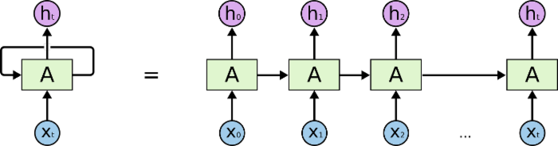

## LSTM模型

### 引言

人类并不是每时每刻都从一片空白的大脑开始思考问题。在阅读这篇文章时，你都是基于自己已有的对先前所见词的理解来推断当前词的真实含义。我们不会将所有的东西都全部丢弃，然后用空白的大脑进行思考。我们的思想拥有持久性。

传统的神经网络并不能做到这点。例如，假设你希望对电影中的每个时间点的时间类型进行分类。传统的神经网络应该很难来处理这个问题——使用电影中先前的事件推断后续的事件。

RNN，循环神经网络，Recurrent Neural Networdks，解决了这个问题。RNN是包含循环的网络，允许信息的持久化。

如下图左所示，神经网络模块A，正在读取某个输入$x_i$，并输出一个值$h_i$。循环可以使得信息可以从当前步传递到下一步。RNN可以被看作是同一神经网络的多次赋值，每个神经网络模块会把信息传递给下一个。所以，将循环展开如下图右所示。

链式的特征揭示了RNN本质上是与序列和列表相关的。它们是对这类数据的最自然的神经网络架构。并且RNN在过去几年内，在语言识别、翻译等问题上取得了一定成功。

### 简单理解

RNN的关键点之一就是他们可以用来连接先前的信息到当前的任务上，例如使用过去的视频段来推测对当前段的理解。但是，还有一些依赖因素影响RNN的效果。

例如，当相关信息和当前预测位置之间的间隔增大时，RNN会丧失学习远距离信息的能力。

LSTM，长短期记忆模型，long-short term memory，是一种特殊的RNN模型，是为了解决RNN模型梯度弥散的问题而提出的；在传统的RNN中，训练算法使用BPTT，当时间比较长时，需要回传的残差会指数下降，导致网络权重更新缓慢，无法体现出RNN的长期记忆的效果，因此需要一个存储单元来存储记忆，因此LSTM模型被提出。

LSTM通过刻意设计来避免长期依赖问题。记住长期的信息在实践中是LSTM的默认行为，而非需要付出很大代价才能获得的能力。

所有RNN都具有一种重复神经网络模块的链式的形式。在标准的RNN中，这个重复的模块只有一个非常简单的结构，例如一个tanh层。

LSTM同样是这样的结构，但是重复的模块拥有一个不同的结构。不同于单一神经网络层，这里是有四个，以一种非常特殊的方式进行交互。

在上面的图例中，

- 每一条黑线传输着一整个向量，从一个节点的输出到其他节点的输入；
- 粉色的圈代表 pointwise 的操作，诸如向量的和；
- 黄色的矩阵就是学习到的神经网络层；
- 合在一起的线表示向量的连接，分开的线表示内容被复制，然后分发到不同的位置。

### LSTM核心思想

### 参考文献

[LSTM模型](https://blog.csdn.net/lyc_yongcai/article/details/73201446)